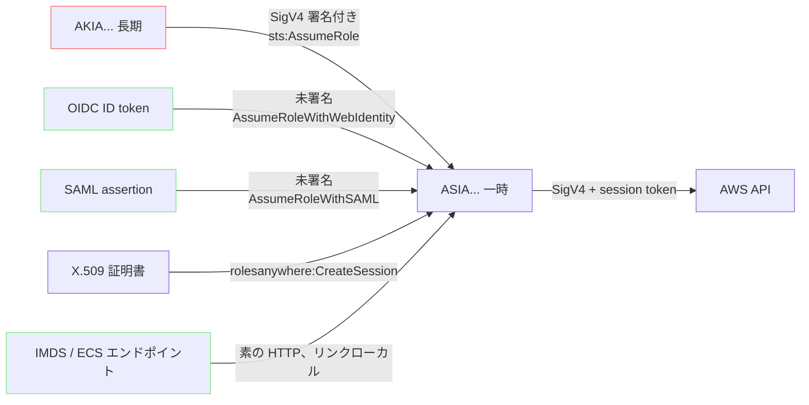
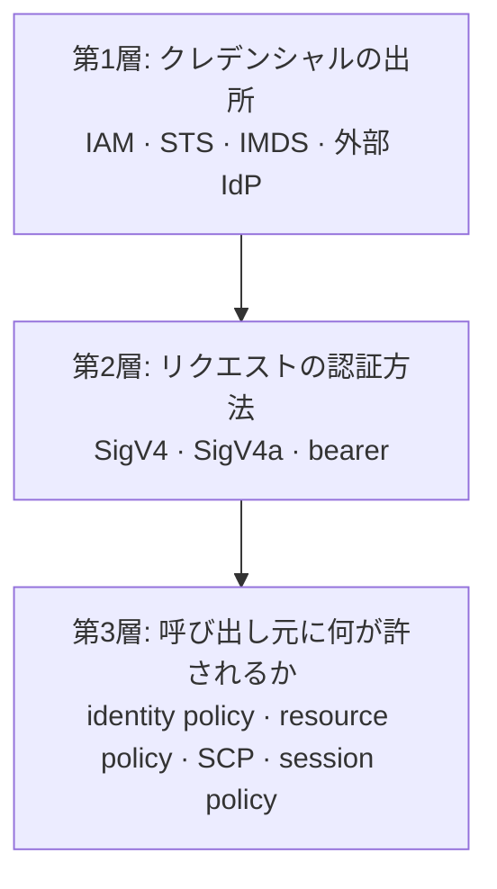

[English](01-credential-map.md) | **日本語**

# クレデンシャルの地図

[ノートに戻る](README.ja.md)

## 何がクレデンシャルなのか

AWS の API を呼ぶという目的に限れば、形は2つだけ。それに最近増えた、どちらにも当てはまらない3つ目
が加わる。

| 形 | 構成要素 | 発行元 | 期限 |
| --- | --- | --- | --- |
| 長期キー | `AKIA...` + secret | `iam:CreateAccessKey` | 無し |
| 一時クレデンシャル | `ASIA...` + secret + session token | STS | 必ずある |
| bearer token | 不透明な文字列1本 | Bedrock, CloudWatch | 種類による |

長期キーは、期限を持たない唯一の AWS API クレデンシャル。このページに書く残り全部は、その1点から
派生している。

## 入り口の問題

STS も普通の AWS サービスなので、呼ぶには署名が要り、署名にはクレデンシャルが要る。これは循環して
いて、フェデレーションの仕組みは全部この循環を断つために存在する。

`AssumeRoleWithWebIdentity` と `AssumeRoleWithSAML` は、AWS クレデンシャルを一切持たずに呼べる唯一の
STS API。未署名の HTTP リクエストで、ボディに「他人が署名した assertion」を載せる。仕掛けはそれだけ
で、CI パイプラインに `AKIA` が1本も要らなくなる理由もこれ。

IMDS は別のやり方で循環を断つ。プラットフォームが既に AssumeRole を済ませ、その結果をリンクローカル
アドレスに置いている。

## 各経路の役割

- **長期キー。** 基準線であり、消す対象。IAM user が同時に持てるキーは Active/Inactive を問わず2本
  まで。3本目は `LimitExceeded`。2本あることがローテーションを成立させている。作る、切り替える、
  消す。
- **AssumeRole。** クロスアカウントと権限分離。既にクレデンシャルが必要なので、入り口ではなく連鎖の
  途中の1ステップ。
- **OIDC フェデレーション。** CI から長期キーを消す。仕事をしているのは trust policy で、そこを
  間違える話は [フェデレーション](03-federation.ja.md) で扱う。
- **IMDS。** EC2 や Lambda のディスクに何も置かなくてよい理由。IMDSv2 の `PUT` は趣味ではない。SSRF
  は脆弱なアプリから `GET` を引き出せても、カスタムヘッダ付きの `PUT` はまず引き出せない。
- **bearer token。** API キーを期待していて署名を教え込めないツール向け。AWS 自身の案内も「STS が
  不可能な場合に限れ」。

## 3つの層

混乱のほとんどは、SigV4 と STS をセットだと思うところから来る。セットではなく、別の層にいる。

長期キーも一時クレデンシャルも、同じアルゴリズムの SigV4 で署名する。ワイヤー上の違いは
`X-Amz-Security-Token` ヘッダが増えることだけで、そのヘッダは `SignedHeaders` にも入れる必要がある。
自前実装で `SignatureDoesNotMatch` が出る最頻出の原因がこの入れ忘れ。

## エラーの読み方

層に順番があるので、エラーがどの層まで到達したかを教えてくれる。

| エラー | 到達した層 | 意味 |
| --- | --- | --- |
| `InvalidClientTokenId` | 2 | `ASIA...` を session token 無しで送った |
| `SignatureDoesNotMatch` | 2 | 署名を再計算したら違った |
| `RequestTimeTooSkewed` | 2 | タイムスタンプが許容窓の外 |
| `ExpiredToken` | 2 | `Expiration` を過ぎている |
| `AccessDenied` | 3 | 署名は通り、ポリシーが拒否した |

`AccessDenied` は第2層については良い知らせ。クレデンシャルが問題ならそこまで到達していない。

## API 用ではないクレデンシャルもある

ここまでは全部「AWS の API を呼ぶ」話。データプレーンに対する認証は別の一族で、上のルールに従わない。
RDS のマスターパスワード、IAM database authentication、Redshift の `GetClusterCredentials`、secret key
から導出する SES の SMTP credential、CodeCommit と Keyspaces の service-specific credential、IoT の
X.509 クライアント証明書、MSK の SASL/SCRAM secret、Cognito の user pool token、API Gateway の API
キー、CloudFront の signed URL。ここでは扱わないが、「クレデンシャルなら上の3つの形のどれかだ」と
結論する前に、存在だけは知っておく価値がある。
