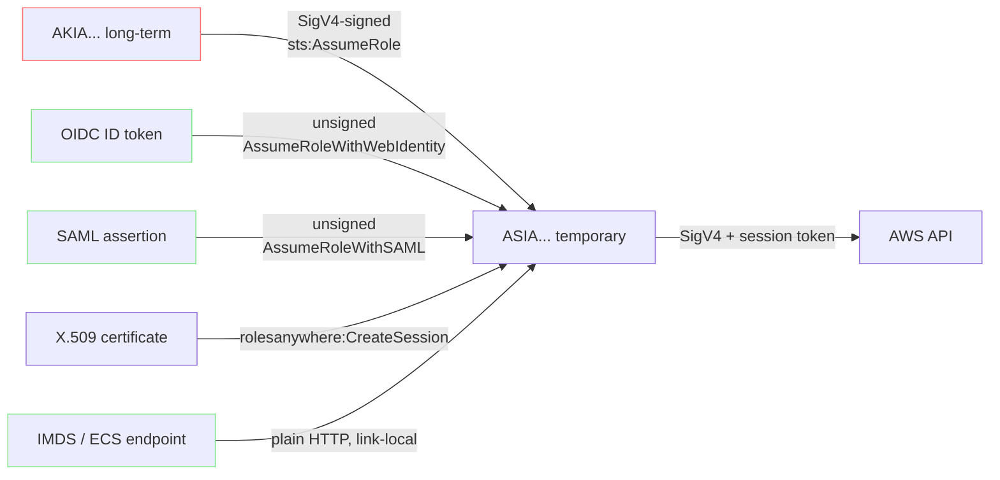
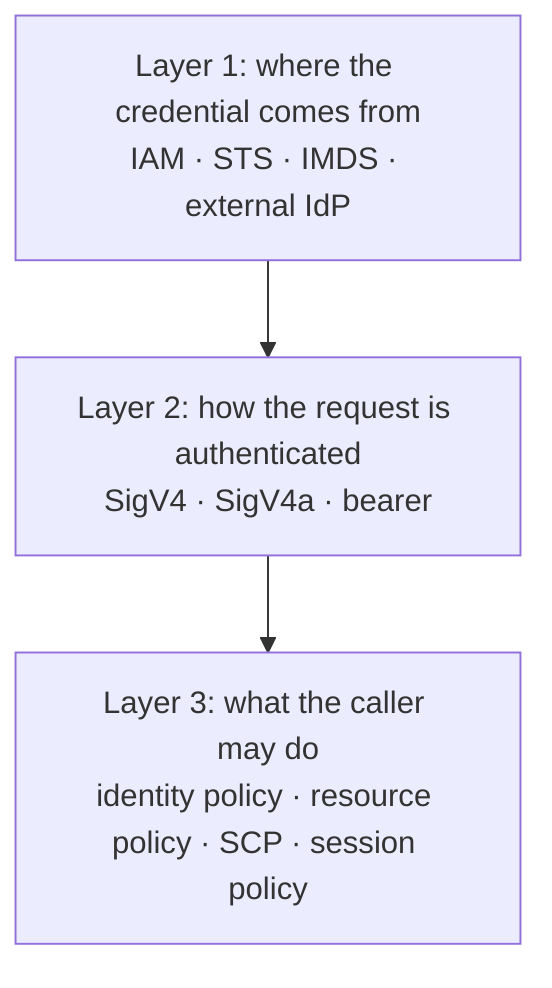

**English** | [日本語](01-credential-map.ja.md)

# The credential map

[Back to notes](README.md)

## What counts as a credential

For calling an AWS API there are exactly two shapes, plus a third that arrived recently
and does not fit either.

| Shape | Components | Issued by | Expires |
| --- | --- | --- | --- |
| Long-term key | `AKIA...` + secret | `iam:CreateAccessKey` | Never |
| Temporary credential | `ASIA...` + secret + session token | STS | Yes, always |
| Bearer token | One opaque string | Bedrock, CloudWatch | Depends |

The long-term key is the only AWS API credential with no expiry. That single property is
the reason for everything else on this page.

## The entry problem

STS is an ordinary AWS service, so calling it requires a signature, which requires a
credential. That is circular, and every federation mechanism exists to break the circle.

`AssumeRoleWithWebIdentity` and `AssumeRoleWithSAML` are the only STS APIs callable with
no AWS credential at all. They take an unsigned HTTP request whose body carries an
assertion signed by somebody else. That is the whole trick, and it is why a CI pipeline
needs no `AKIA` anywhere.

IMDS breaks the circle differently: the platform has already done the AssumeRole and
leaves the result on a link-local address.

## What each path is actually for

- **Long-term key.** The baseline, and the thing to remove. An IAM user may hold two keys
  at a time, Active or Inactive, and a third request returns `LimitExceeded`. Two is what
  makes rotation possible at all: create, cut over, delete.
- **AssumeRole.** Cross-account access and privilege separation. Needs credentials
  already, so it is a step in a chain rather than an entry point.
- **OIDC federation.** Ends long-term keys in CI. The trust policy does the work, and
  getting it wrong is the subject of [Federation](03-federation.md).
- **IMDS.** Why an EC2 instance or a Lambda needs nothing on disk. The `PUT` in IMDSv2 is
  not stylistic: server-side request forgery can usually coerce a `GET` out of a
  vulnerable application, rarely a `PUT` carrying a custom header.
- **Bearer tokens.** For tools that expect an API key and cannot be taught to sign. AWS's
  own guidance is to use them only where STS is impossible.

## The three layers

Most confusion comes from treating SigV4 and STS as a pair. They are not; they sit in
different layers.

A long-term key and a temporary credential both sign with SigV4, using the identical
algorithm. The only difference on the wire is the extra `X-Amz-Security-Token` header,
which must also appear in `SignedHeaders`. Omitting it is the most common cause of
`SignatureDoesNotMatch` in hand-rolled clients.

## Reading the error

Because the layers are ordered, the error names the layer.

| Error | Layer reached | What it means |
| --- | --- | --- |
| `InvalidClientTokenId` | 2 | An `ASIA...` key sent without its session token |
| `SignatureDoesNotMatch` | 2 | Signature recomputed and differed |
| `RequestTimeTooSkewed` | 2 | Timestamp outside the accepted window |
| `ExpiredToken` | 2 | Past `Expiration` |
| `AccessDenied` | 3 | Signature verified, policy said no |

An `AccessDenied` is good news about layer 2. If credentials were the problem you would
never have got that far.

## Not all credentials are for the API

Everything above is about calling AWS APIs. A separate family authenticates to data
planes and follows none of these rules: RDS master passwords, IAM database
authentication, Redshift `GetClusterCredentials`, SES SMTP credentials derived from the
secret key, CodeCommit and Keyspaces service-specific credentials, IoT X.509 client
certificates, MSK SASL/SCRAM secrets, Cognito user-pool tokens, API Gateway API keys,
CloudFront signed URLs. They are out of scope here, but worth knowing they exist before
concluding that a credential must be one of the three shapes above.
