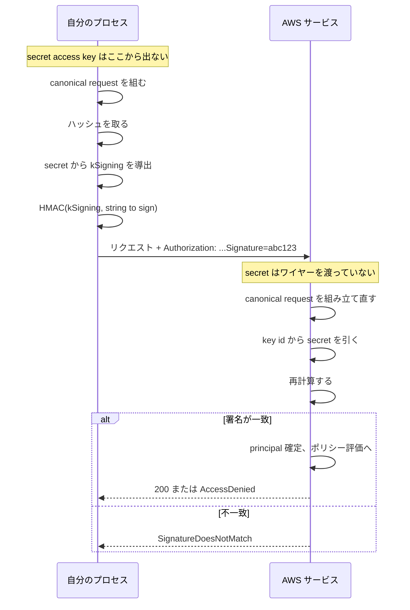
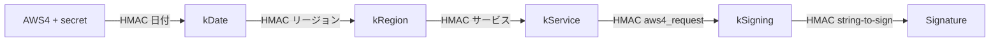

[English](02-sigv4.md) | **日本語**

# SigV4

[ノートに戻る](README.ja.md)

## 何であって何でないか

SigV4 は署名の層。STS と紐づいていないし、クレデンシャルの出所によって変わることもない。長期の
`AKIA` キーでも一時的な `ASIA` クレデンシャルでも、走るアルゴリズムは同一で、一時の場合にヘッダが
1つ増えるだけ。

対称鍵方式。両側が同じ secret を持ち、両側が同じ HMAC を計算する。secret 自体は一度も移動しない。



## ワイヤーに乗るもの

一時クレデンシャルの3要素のうち、2つは移動し、1つは移動しない。

| 要素 | リクエストに乗るか | どこに |
| --- | --- | --- |
| `AccessKeyId` | 乗る | `Credential=ASIA.../20260919/us-east-1/s3/aws4_request` |
| `SessionToken` | 乗る | `X-Amz-Security-Token` ヘッダ |
| `SecretAccessKey` | **絶対に乗らない** | HMAC の入力としてローカルで使うだけ |

この非対称性が、署名と bearer token の違いそのもの。署名済みリクエストを傍受しても手に入るのは、
既に使い終わったその1本だけ。bearer token を傍受すると、クレデンシャルそのものが手に入る。

## canonical request

両側がこの文字列を組み立てる。1バイトでも違えば一致しない。

```text
GET
/key.txt

host:my-bucket.s3.us-east-1.amazonaws.com
x-amz-content-sha256:e3b0c44298fc1c149afbf4c8996fb92427ae41e4649b934ca495991b7852b855
x-amz-date:20260919T120000Z
x-amz-security-token:IQoJb3JpZ2luX2Vj...

host;x-amz-content-sha256;x-amz-date;x-amz-security-token
e3b0c44298fc1c149afbf4c8996fb92427ae41e4649b934ca495991b7852b855
```

上から、メソッド、パス、クエリ文字列、canonical headers、署名対象ヘッダ名の一覧、ペイロードハッシュ。

自前実装が失敗する原因はだいたい次の3つ。

1. **URI エンコードが `encodeURIComponent` より厳しい。** unreserved は `A-Za-z0-9-_.~` だけ。
   `encodeURIComponent` は `!*'()` を残すが AWS は残さない。自分で書くこと。
2. **S3 はパスを二重エンコードしない。** 他のサービスは canonicalize の際にパスをもう一度 URI
   エンコードする。これを逆にすると、予約文字を含むパスのときだけ不一致になる。つまりテストでは通り、
   本番で落ちる。
3. **`x-amz-security-token` を `SignedHeaders` に入れる。** ヘッダだけ送って一覧に入れないと、両側が
   別の文字列を canonicalize することになる。

## signing key の連鎖



日付・リージョン・サービスは、鍵の横に併記されるのではなく鍵に焼き込まれる。`kSigning` が漏れても、
その日・そのリージョン・そのサービスにしか使えない。意図的な被害範囲の制御であり、credential scope が
2箇所に出てくる理由でもある。鍵の中に1回、そしてサーバがどの鍵を導出すべきか知るために `Credential=`
パラメータに1回。

## 署名が守る範囲

canonical request に入っているもの全部。思っているより広い。

- メソッド、パス、クエリ文字列
- `SignedHeaders` に挙げた全ヘッダ。session token も含む
- **ボディ**。SHA-256 経由で。1バイト変えれば署名は無効になる

つまり SigV4 は認証と完全性を同時に提供する。機密性は提供しない。それは TLS の仕事。

タイムスタンプがリプレイを限定する。S3 は自分の時計から15分以上ずれたリクエストを
`RequestTimeTooSkewed` で拒否し、AWS の一般的な案内はさらに厳しく、多くの場合5分以内に到達する必要が
ある。

## 実装の検証方法

AWS は期待値付きの計算例を公開している。このリポジトリのテストが使っているのは Amazon Glacier の
Create Vault の例で、公開されたアクセスキー、secret、タイムスタンプ、ヘッダに対して、canonical
request、string to sign、最終的な署名が全て明記されている。3つとも再現できれば実装は正しい。

同じページにもう1つ例があるが、そちらの署名値は再現できない。[検証](05-verification.ja.md) を参照。
