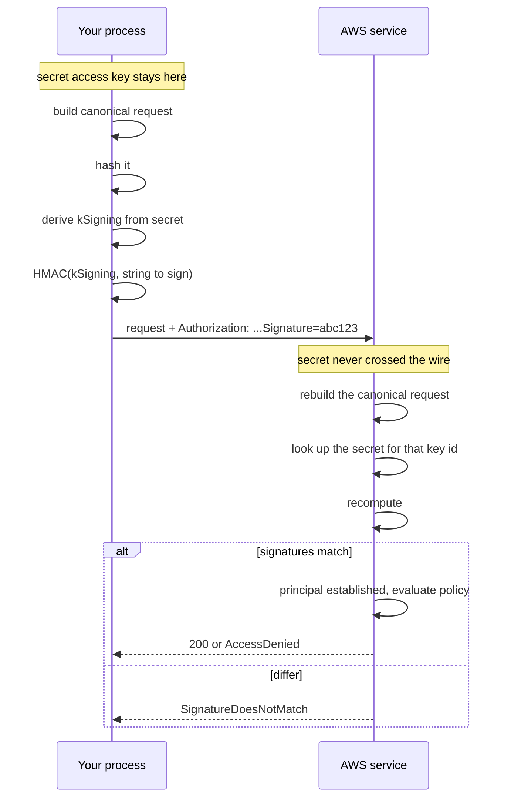
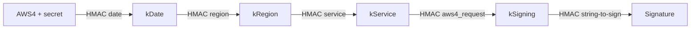

**English** | [日本語](02-sigv4.ja.md)

# SigV4

[Back to notes](README.md)

## What it is and is not

SigV4 is the signing layer. It is not tied to STS, and it does not change depending on
where the credential came from. A long-term `AKIA` key and a temporary `ASIA` credential
run the identical algorithm; the temporary case adds one header.

It is a symmetric scheme. Both sides hold the same secret and both compute the same HMAC.
The secret itself never travels.



## What goes on the wire

Of the three components of a temporary credential, two travel and one does not.

| Component | On the request? | Where |
| --- | --- | --- |
| `AccessKeyId` | Yes | `Credential=ASIA.../20260919/us-east-1/s3/aws4_request` |
| `SessionToken` | Yes | `X-Amz-Security-Token` header |
| `SecretAccessKey` | **Never** | Used locally as HMAC input only |

That asymmetry is the difference between a signature and a bearer token. Intercepting a
signed request gives you that one request, already spent. Intercepting a bearer token
gives you the credential.

## The canonical request

Both sides build this string. It has to match byte for byte.

```text
GET
/key.txt

host:my-bucket.s3.us-east-1.amazonaws.com
x-amz-content-sha256:e3b0c44298fc1c149afbf4c8996fb92427ae41e4649b934ca495991b7852b855
x-amz-date:20260919T120000Z
x-amz-security-token:IQoJb3JpZ2luX2Vj...

host;x-amz-content-sha256;x-amz-date;x-amz-security-token
e3b0c44298fc1c149afbf4c8996fb92427ae41e4649b934ca495991b7852b855
```

Line by line: method, path, query string, canonical headers, the list of signed header
names, and the payload hash.

Three details cause most hand-rolled failures.

1. **URI encoding is stricter than `encodeURIComponent`.** Only `A-Za-z0-9-_.~` are
   unreserved. `encodeURIComponent` leaves `!*'()` alone and AWS does not. Write your own.
2. **S3 does not double-encode the path.** Every other service URI-encodes the path a
   second time during canonicalisation. Getting this backwards produces a mismatch only
   for paths containing reserved characters, so it passes in testing and fails in
   production.
3. **`x-amz-security-token` must be in `SignedHeaders`.** Sending the header without
   listing it means the two sides canonicalise different things.

## The signing key chain



The date, region and service are baked into the key rather than merely stated alongside
it. A leaked `kSigning` works for that day, that region and that service, and nothing
else. That is a deliberate blast-radius control, and it is why the credential scope
appears twice: once inside the key, once in the `Credential=` parameter so the server
knows which key to derive.

## What the signature covers

Everything in the canonical request, which is more than people expect.

- The method, the path and the query string.
- Every header named in `SignedHeaders`, including the session token.
- **The body**, through its SHA-256. Changing one byte invalidates the signature.

So SigV4 provides authentication and integrity together. It does not provide
confidentiality; that is TLS's job.

The timestamp bounds replay. S3 rejects a request more than 15 minutes from its own clock
with `RequestTimeTooSkewed`, and AWS's general guidance is tighter still: in most cases a
signed request must arrive within five minutes.

## Verifying your implementation

AWS publishes worked examples with expected values. The one used in this repository's
tests is the Amazon Glacier Create Vault example: given the published access key, secret,
timestamp and headers, the canonical request, the string to sign and the final signature
are all stated. If your implementation reproduces all three you are done.

There is a second example on that page whose published signature is not reproducible. See
[Verification](05-verification.md).
