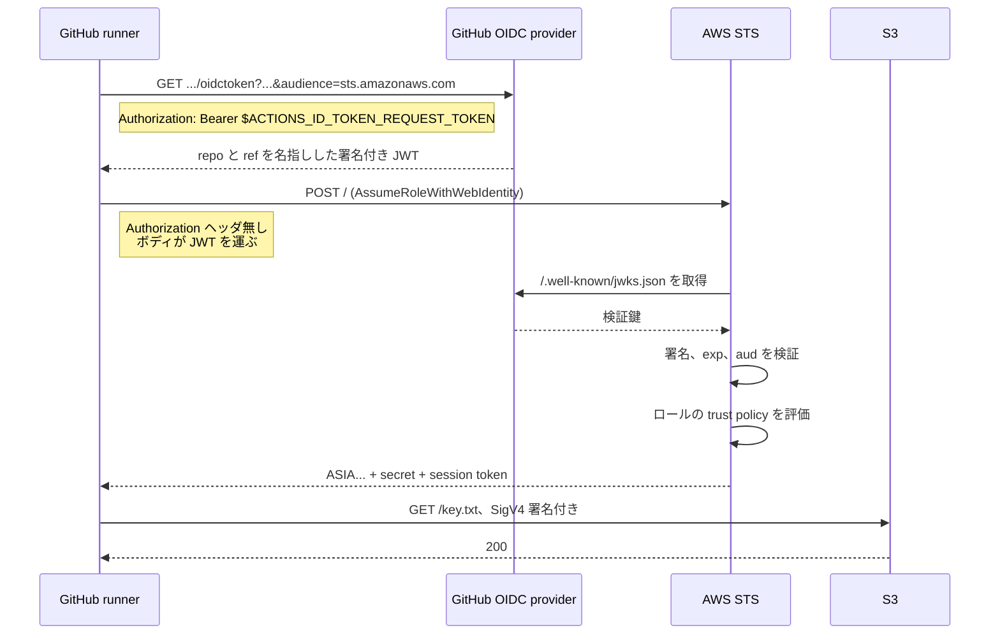

[English](03-federation.md) | **日本語**

# フェデレーション

[ノートに戻る](README.ja.md)

## 6つの発行 API

STS は単一の関数ではない。クレデンシャルを返すのは次の操作。

| API | 入り口の条件 | 上限 |
| --- | --- | --- |
| `AssumeRole` | 既存の署名可能なクレデンシャル | ロールの `MaxSessionDuration` |
| `AssumeRoleWithSAML` | SAML assertion、**AWS クレデンシャル不要** | 同上 |
| `AssumeRoleWithWebIdentity` | OIDC ID token、**AWS クレデンシャル不要** | 同上 |
| `AssumeRoot` | 管理アカウント | 固定15分 |
| `GetSessionToken` | IAM user のキー、必要なら MFA | 12時間 |
| `GetFederationToken` | IAM user のキー | 12時間 |

`AssumeRole` の `DurationSeconds` は900秒以上で、ロールの `MaxSessionDuration` が上限。その
`MaxSessionDuration` 自体は1〜12時間で設定できる。既定は3600秒。assume したロールからさらに assume
(role chaining) すると、設定に関係なく上限が1時間に落ちる。「設定より早くセッションが切れる」の典型的
な原因がこれ。

`GetSessionToken` は新しい権限を与えない。IAM user の長期キーを、同じ権限を持つ一時クレデンシャルに
昇格させるだけで、必要なら `aws:MultiFactorAuthPresent` が立つ。名前が助けになるより誤解を招く回数の
方が多い。

## なぜ2つだけ未署名なのか

STS を呼ぶには普通は署名が要り、署名にはクレデンシャルが要る。`AssumeRoleWithWebIdentity` と
`AssumeRoleWithSAML` は `Authorization` ヘッダ無しで呼べる。リクエストが「他人が署名した assertion」
を運び、AWS はそちらの署名を検証する。



AWS と GitHub の間に共有秘密はどの時点でも存在しない。AWS は「信頼せよと言われた issuer」を信頼し、
その issuer から取得した鍵で署名を検証するだけ。

## access token ではなく ID token

パラメータ名は `WebIdentityToken` で、API リファレンスは「OAuth 2.0 access token または OpenID
Connect ID token」と書いている。両方受け付けるのは、この API が設計されたソーシャルログイン時代の
名残。今どきの用途はどれも OIDC の **ID token** を入れる。

この区別が効くのは、2つが別の問いに答えているから。

| | ID token | access token |
| --- | --- | --- |
| 主張する内容 | 呼び出し元が誰か | 呼び出し元に何が許されるか |
| audience | 要求したクライアント | リソースサーバ |
| 形式 | 必ず JWT | 規定なし、opaque なことも多い |
| 検証できる者 | JWKS があれば誰でも | 発行者だけ、ということが多い |

STS が欲しいのは身元の主張なので、ID token が正しい形。この非対称性はレスポンスにも残る。`Provider`
には、ID token なら `iss` の値が、access token 経路ならリクエストで渡した `ProviderId` が入る。

## 制御は trust policy が全部握っている

ここまでは仕組みの話。セキュリティ上の判断は1つのドキュメントに集約される。

```json
{
  "Effect": "Allow",
  "Principal": {
    "Federated": "arn:aws:iam::111111111111:oidc-provider/token.actions.githubusercontent.com"
  },
  "Action": "sts:AssumeRoleWithWebIdentity",
  "Condition": {
    "StringEquals": {
      "token.actions.githubusercontent.com:aud": "sts.amazonaws.com"
    },
    "StringLike": {
      "token.actions.githubusercontent.com:sub": "repo:0-draft/caller-identity:ref:refs/heads/main"
    }
  }
}
```

繰り返し現れる間違いは4つ。出現頻度の高い順。

1. **`sub` を全く絞っていない。** `aud` だけ見て終わっている。`aud` はインターネット上の全 GitHub
   Actions ワークフローで `sts.amazonaws.com` なので、その provider に到達できるリポジトリなら何でも
   このロールを assume できる。
2. **`repo:*` や裸の `*`。** 制約に見える。GitHub 上の全リポジトリに一致する。
3. **`repo:my-org/*`。** これは狭いが、特定の意味でまだ間違っている。後から org に追加された
   リポジトリを含み、乗っ取られたアカウントが作ったものも含み、pull request と fork を区別しない。
4. **`Action` に `sts:AssumeRole` と書く。** 呼び出す API 名がそのまま policy に書くべき `Action` 名
   になる。OIDC なら `sts:AssumeRoleWithWebIdentity`、SAML なら `sts:AssumeRoleWithSAML`。これは
   fail closed なので、4つの中では一番害が小さい。

サイトの trust policy パネルは、編集可能なトークンに対してこの4つを実際に評価する。読むのではなく
自分で起こせる。

## outbound federation、鏡像

2025年後半から矢印は逆方向にも向く。`sts:GetWebIdentityToken` が AWS の身元を、外部サービスが検証
できる短命の署名付き JWT に交換する。これで AWS のワークロードは、相手の API キーを保管せずに
サードパーティへ認証できる。

| 向き | API | JWT に署名するのは | 検証するのは |
| --- | --- | --- | --- |
| AWS へ | `sts:AssumeRoleWithWebIdentity` | GitHub、Google、EKS | AWS STS |
| AWS から | `sts:GetWebIdentityToken` | AWS STS | 外部サービス |

有効化するとアカウント専用の issuer URL が払い出され、`/.well-known/openid-configuration` と
`/.well-known/jwks.json` をホストする。発行されるトークンの `sub` はロールの ARN。有効期間は60〜3600
秒で既定は300秒。`Audience`、`DurationSeconds`、`SigningAlgorithm` は開けっ放しにせず IAM policy の
condition で縛るべき。
