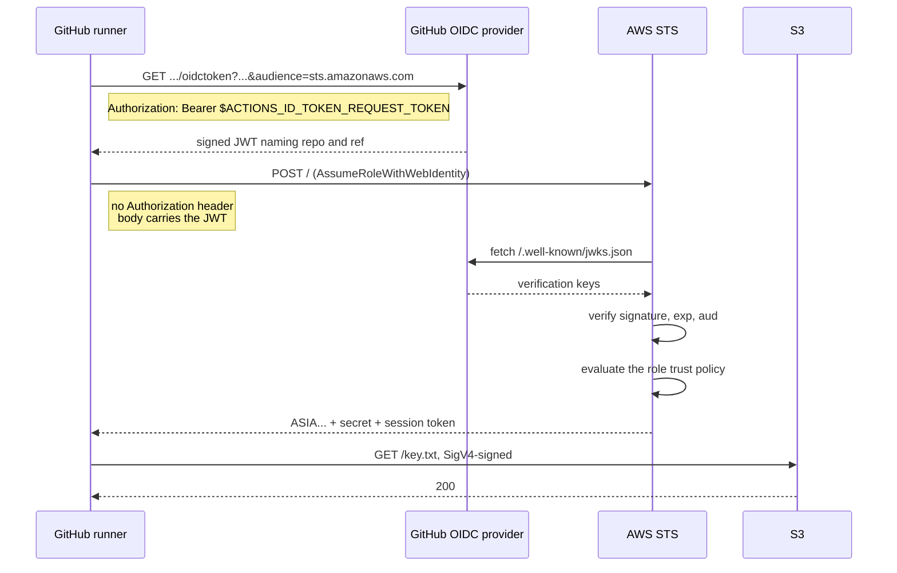

**English** | [日本語](03-federation.ja.md)

# Federation

[Back to notes](README.md)

## The six issuance APIs

STS is not one function. These are the operations that hand back credentials.

| API | Entry requirement | Ceiling |
| --- | --- | --- |
| `AssumeRole` | An existing signed credential | Role's `MaxSessionDuration` |
| `AssumeRoleWithSAML` | A SAML assertion, **no AWS credential** | Same |
| `AssumeRoleWithWebIdentity` | An OIDC ID token, **no AWS credential** | Same |
| `AssumeRoot` | Management account | Fixed 15 minutes |
| `GetSessionToken` | An IAM user key, optionally with MFA | 12 hours |
| `GetFederationToken` | An IAM user key | 12 hours |

`DurationSeconds` on `AssumeRole` accepts 900 seconds upward, bounded by the role's
`MaxSessionDuration`, which is itself settable between 1 and 12 hours. The default is
3600. Assume a role from an already-assumed role and the ceiling drops to one hour
regardless of any setting, which is the usual explanation for a session that expires
sooner than configured.

`GetSessionToken` does not grant new permissions. It upgrades an IAM user's long-term key
to a temporary credential carrying the same permissions, optionally with
`aws:MultiFactorAuthPresent` set. The name misleads more often than it helps.

## Why two of them are unsigned

Calling STS normally requires a signature, which requires a credential. Both
`AssumeRoleWithWebIdentity` and `AssumeRoleWithSAML` are callable with no `Authorization`
header at all. The request carries an assertion signed by somebody else, and AWS verifies
that signature instead.



No shared secret exists between AWS and GitHub at any point. AWS trusts an issuer it was
told to trust, and checks a signature against keys it fetches from that issuer.

## ID token, not access token

The parameter is called `WebIdentityToken`, and the API reference describes it as "the
OAuth 2.0 access token or OpenID Connect ID token". Both are accepted, which is a leftover
from the social-login era the API was designed for. Every modern use puts an OIDC **ID
token** there.

The distinction matters because the two answer different questions.

| | ID token | Access token |
| --- | --- | --- |
| Asserts | Who the caller is | What the caller may do |
| Audience | The client that asked for it | A resource server |
| Format | Always a JWT | Unspecified, often opaque |
| Verifiable by | Anyone, via JWKS | Often only the issuer |

STS needs an identity assertion, so the ID token is the right shape. The asymmetry
survives into the response: `Provider` holds the `iss` value for an ID token, but the
`ProviderId` you sent for an access token.

## The trust policy is the whole control

Everything above is mechanism. The security decision lives in one document.

```json
{
  "Effect": "Allow",
  "Principal": {
    "Federated": "arn:aws:iam::111111111111:oidc-provider/token.actions.githubusercontent.com"
  },
  "Action": "sts:AssumeRoleWithWebIdentity",
  "Condition": {
    "StringEquals": {
      "token.actions.githubusercontent.com:aud": "sts.amazonaws.com"
    },
    "StringLike": {
      "token.actions.githubusercontent.com:sub": "repo:0-draft/caller-identity:ref:refs/heads/main"
    }
  }
}
```

Four recurring mistakes, in rough order of how often they appear.

1. **`sub` not constrained at all.** The policy checks `aud` and stops. `aud` is
   `sts.amazonaws.com` for every GitHub Actions workflow on the internet, so the role
   becomes assumable by any repository that can reach the provider.
2. **`repo:*` or a bare `*`.** Looks like a constraint. Matches every repository on
   GitHub.
3. **`repo:my-org/*`.** Narrower, and still wrong in a specific way: it covers
   repositories added to the org later, including ones created by a compromised account,
   and it does not distinguish a pull request from a fork.
4. **`sts:AssumeRole` written as the `Action`.** The API you call is the `Action` the
   policy must name. OIDC needs `sts:AssumeRoleWithWebIdentity`, SAML needs
   `sts:AssumeRoleWithSAML`. This one fails closed, which makes it the least dangerous of
   the four.

The site's trust-policy panel evaluates all four against an editable token, so the failure
is something to cause rather than read about.

## Outbound federation, the mirror image

Since late 2025 the arrow also points the other way. `sts:GetWebIdentityToken` exchanges
an AWS identity for a short-lived signed JWT that external services can verify, which lets
an AWS workload authenticate to a third party without storing that party's API key.

| Direction | API | Who signs the JWT | Who verifies |
| --- | --- | --- | --- |
| Into AWS | `sts:AssumeRoleWithWebIdentity` | GitHub, Google, EKS | AWS STS |
| Out of AWS | `sts:GetWebIdentityToken` | AWS STS | The external service |

Enabling it mints an issuer URL for the account, hosting the usual
`/.well-known/openid-configuration` and `/.well-known/jwks.json`. The `sub` of the issued
token is the role ARN. Tokens last 60 to 3600 seconds and default to 300, and the
`Audience`, `DurationSeconds` and `SigningAlgorithm` should be constrained by IAM policy
conditions rather than left open.
