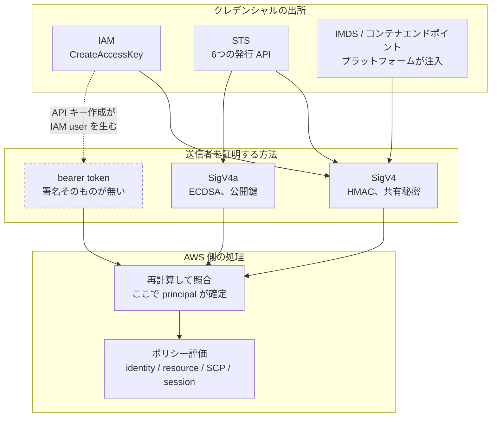

[English](README.md) | **日本語**

# ノート

サイトがインタラクティブに見せている内容の、長い版。パネルに収まらない部分をここに置く。各仕組みが
なぜその形なのか、ドキュメントと実装がどこで食い違うのか、そしてここに書いた主張をどう検証したか。

## 目次

| ページ | 扱う内容 |
| --- | --- |
| [クレデンシャルの地図](01-credential-map.ja.md) | リクエストが身元を得る全経路と、それらが共有する3つの層 |
| [SigV4](02-sigv4.ja.md) | 署名の全工程。canonical request、鍵の連鎖、署名が守る範囲 |
| [フェデレーション](03-federation.ja.md) | STS の発行 API、OIDC、そして繰り返される trust policy の間違い |
| [presigned URL と SigV4a](04-variants.ja.md) | 同じ署名を URL に移したものと、非対称な複数リージョン版 |
| [検証](05-verification.ja.md) | 各主張の検証方法と、AWS ドキュメントで見つかった誤り |

## 短い版

層は3つ。混乱のほとんどは、この3つを一緒くたにすることから来る。

SigV4 は STS と紐づいていない。SigV4 は署名の層であり、長期キーも一時クレデンシャルも同じ層を
そのまま使う。STS はその層に供給する発行元の1つでしかない。bearer token は署名の層を丸ごと飛ばす。

一番多くを説明する事実はこれ。**`AccessDenied` が返ってきた時点で署名は既に通っている。** 認証と認可
は別のステップで、その順番であり、エラーがどちらを通過済みかを教えてくれる。

## 表記について

ここに出てくるキーは全て AWS が自身のドキュメントで公開しているサンプル値で、本物の秘密は含まない。
