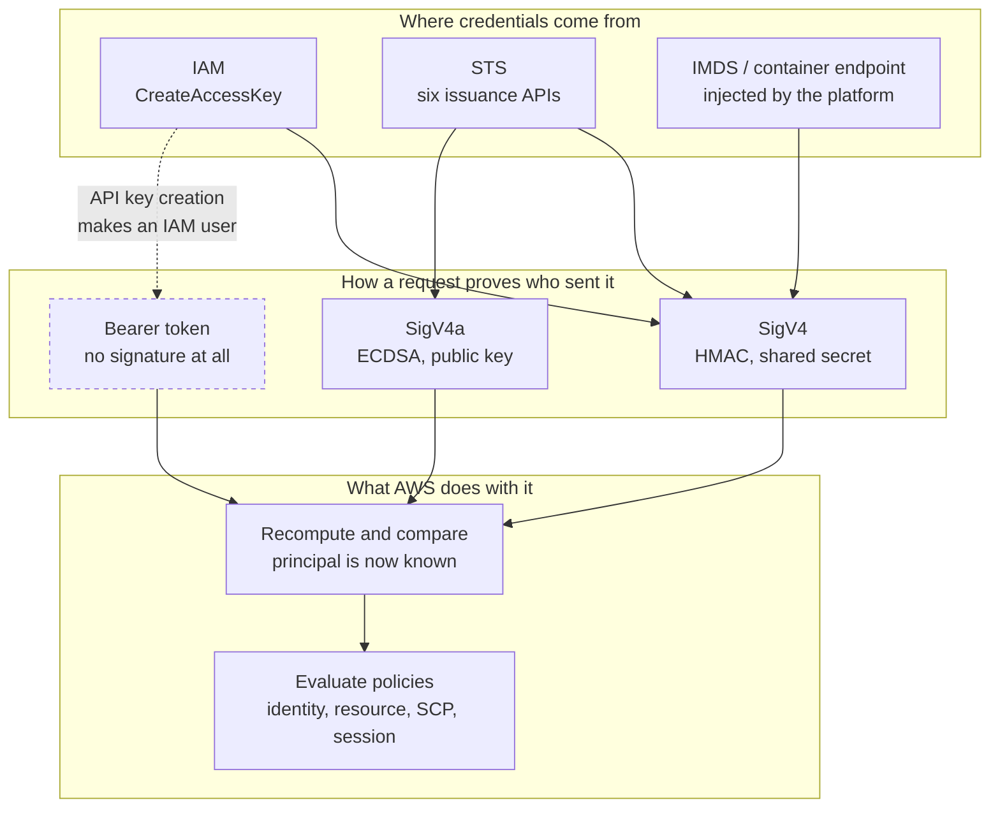

**English** | [日本語](README.ja.md)

# Notes

The long-form version of what the site shows interactively. These pages carry the parts
that do not fit in a panel: why each mechanism is shaped the way it is, where the
documentation and the implementations disagree, and how every claim here was checked.

## Contents

| Page | What it covers |
| --- | --- |
| [The credential map](01-credential-map.md) | Every way a request gets an identity, and the three layers they share |
| [SigV4](02-sigv4.md) | The signature in full: canonical request, key chain, what the signature covers |
| [Federation](03-federation.md) | STS issuance APIs, OIDC, and the trust policy mistakes that keep recurring |
| [Presigned URLs and SigV4a](04-variants.md) | The same signature moved into a URL, and the asymmetric multi-region variant |
| [Verification](05-verification.md) | How each claim was checked, and an error in the AWS documentation |

## The short version

Three layers, and most confusion comes from collapsing them.

SigV4 is not tied to STS. It is the signing layer, and both long-term keys and temporary
credentials use it unchanged. STS is one of several issuers feeding that layer. Bearer
tokens skip the signing layer entirely.

The single fact that explains the most: **an `AccessDenied` means the signature already
verified.** Authentication and authorisation are separate steps, in that order, and the
error tells you which one you are past.

## Conventions

Every key in these pages is an example value AWS publishes in its own documentation.
Nothing here is a real secret.
